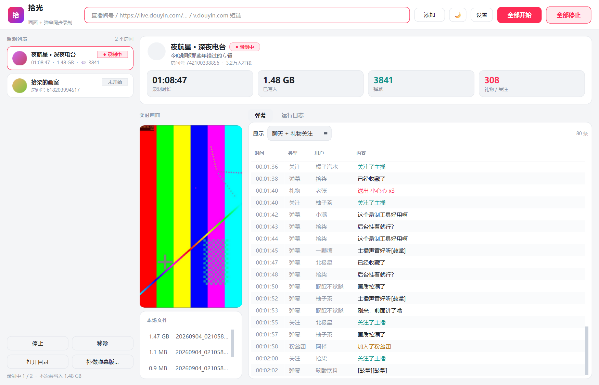
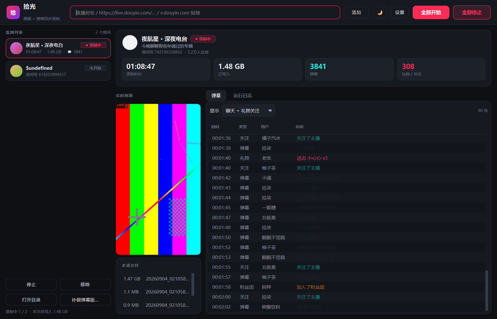

<div align="center">

# 拾光 · Lumina

**抖音直播录制 —— 画面无损、弹幕结构化，还能把弹幕封成字幕轨**

多房间同时监测 · 开播自动开录 · 断网自动重连 · 图形界面开箱即用


</div>



> 截图里的画面是 ffmpeg 合成的测试图，弹幕和昵称都是编的 —— 不拿真实主播的
> 内容做展示。界面和数据流本身都是真跑出来的。

---

画面用 ffmpeg 直接 remux 保存（**不转码**，无损、几乎不占 CPU），弹幕从直播间的
WebSocket 抓下来解成结构化事件。两边共用同一个起录时刻做时间基准，所以录完
之后弹幕能直接对着视频播。

支持**多房间同时监测**：列表里的房间各录各的，开播自动开始、下播继续守候；
所有房间共用一个后台浏览器，五个房间也就一份浏览器的内存开销。

## 能做什么

- **画面 + 弹幕同步录制**，时间轴对得上，弹幕带 `offset` 秒数
- **弹幕自动封成字幕轨**，产出 `.mkv`，软字幕不重编码、画质无损、播放器里可开关
- **多房间并行**，共用一个 Chromium，不是每个房间开一个浏览器
- **守候模式**：没开播就挂着，开播自动开录，下播自动收工继续守候
- **三层断线重连**，并且能区分「主播下播了」和「我这边断网了」
- **实时预览**：另拉一路最低画质的流，不碰录制那一路
- **不用装任何东西**：Windows 单文件 exe 自带 Chromium 和 ffmpeg
- 浅色 / 深色主题

<details>
<summary>深色主题截图</summary>



</details>

## 快速开始

### Windows：直接用 exe

到 [Releases](../../releases) 下载 `Lumina.exe`，双击就能用，**不需要装 Python、
ffmpeg 或浏览器**。

首次启动会弹一个进度框，把内置的 Chromium 和 ffmpeg 解压到
`%LOCALAPPDATA%\Lumina\runtime`（约 640MB，一次性）。之后每次启动直接复用。
想彻底清干净就删掉 `%LOCALAPPDATA%\Lumina` 整个目录。

> 这个 exe 没有代码签名，Windows SmartScreen 可能会拦一下 ——
> 点「更多信息」→「仍要运行」即可。

录不了的时候先跑一遍自检，它会分别确认运行时、ffmpeg、浏览器、网络这四块：

```bash
Lumina.exe --selftest
```

结果同时写到 `%LOCALAPPDATA%\Lumina\selftest.txt`。程序启动阶段真崩了的话，
traceback 在同目录的 `crash.log` 里。

### 从源码运行（Windows / macOS / Linux）

```bash
pip install -r requirements.txt
python -m playwright install chromium
python gui.py
```

还需要 **ffmpeg** 在 PATH 里：Windows `winget install Gyan.FFmpeg`，
macOS `brew install ffmpeg`。

命令行版是单房间的，适合做定时任务或脚本调用：

```bash
python main.py 123456789 --info            # 只看房间状态和各画质地址
python main.py 123456789 --watch           # 没开播就守着，开播自动开录
python main.py 123456789 --no-video        # 只收弹幕
python main.py 123456789 --segment 3600    # 每小时切一个文件
```

按一次 `Ctrl-C` 走优雅停止（ffmpeg 会把文件收尾写完），按第二次强制退出。

## 界面怎么用

填直播间号 → 「添加」，房间就进了左边的监测列表并开始守候。点列表里任意一个，
右边会显示它的实时画面、指标和弹幕流。

- **左边是监测列表**，每个房间独立显示状态（守候中 / 录制中）、时长、已写入
  大小和弹幕数。底部按钮对当前选中的房间生效，顶栏的「全部开始 / 全部停止」
  对所有房间生效。
- **实时预览**另开一路**最低画质**的流来解码（几百 kbps），刻意不复用录制那一路
  ——否则界面卡一下就可能连累录制。不需要的话在设置里关掉。预览区会按画面
  比例自动定宽：竖屏窄、横屏宽，两边都不留黑边；分割线可以手动拖，拖过之后
  不会再被自动调整覆盖。默认跟着直播源的帧率走（一般 25~30fps），机器吃力的话
  在设置里把「预览清晰度 / 帧率」往下调，只影响窗口里那块画面，和录下来的
  文件完全无关。
- 预览下面是**本场文件**，实时列出这次录了哪些文件、各多大。
- **弹幕面板上方的「显示」只影响看什么，不影响存什么**。热门房间里进场消息能
  占九成，默认过滤掉它们，聊天才看得见。要改存什么用设置里的「记录哪些事件」。
- 监测列表和所有设置存在 `%LOCALAPPDATA%\Lumina\config.json`（macOS 在
  `~/Library/Application Support/Lumina/`），下次打开自动恢复。
- 右上角的月亮/太阳图标切换浅色和深色主题。

## 断流和断网会怎样

三层重连，从轻到重：

1. ffmpeg 自带 `-reconnect`，网络短暂抖动它自己就恢复，录制文件不断开；
2. ffmpeg 真的退出后，会隔 `retry_delay` 秒重连，新片段文件名带 `_r1`、`_r2` 后缀；
3. 弹幕那边由浏览器页面自己重连 WebSocket；页面本身打不开也会重试 3 次。

关键在于**「查不到直播间」和「主播下播了」必须分开处理**：断网时房间查询同样
返回不了状态，早期版本把这种情况当成下播直接收工，恰恰在最不该停的时候停了。
现在 `RoomInfo.ok` 单独表示「这次查询本身成不成功」，只有确认未开播才结束，
查不到就按暂时性故障继续重试（连续 30 次失败才放弃）。

## 弹幕收不到？多半是被风控挡了

抖音会给后台的**无头浏览器**返回一个「验证码中间页」，直播间的 JS 根本不加载，
一个 WebSocket 都建不起来。症状很有辨识度：**画面正常录、弹幕一条都没有**，
`.jsonl` 是 0 字节 —— 因为拉流地址走的是另一条接口，不受影响。

解决办法是**自己过一次验证**：

1. 设置 → 勾选**「显示浏览器窗口」**；
2. 同时确认**「保持登录态」**是勾上的；
3. 停止再开始该房间，在弹出的 Chromium 窗口里完成验证。

验证结果存在 `%LOCALAPPDATA%\Lumina\chrome-data`，之后不必每次都做。

程序不会替你绕过验证码。它能做的是**别瞒着你**：落在验证页时会报错并给出上面
这段提示，另外有一个 45 秒看门狗 —— 只要弹幕 WebSocket 没连上就报警，这条不
依赖抖音的具体措辞，换别的拦法照样报得出来。界面上会显示一条琥珀色横幅：

> ⚠ 被抖音风控挡在验证页，收不到弹幕。画面不受影响，仍在正常录制。

## 弹幕字幕

默认开启：**每场录完自动把弹幕做成 ASS 滚动字幕，作为一条轨道封进视频**，
产出 `.mkv`。用的是软字幕 —— 音视频原样 `-c copy` 搬过去、**不重新编码**，
所以画质无损、几小时的录像一两分钟就完事，播放器里还能随时开关弹幕。
（硬字幕要重编码，两小时 1080p 纯 CPU 得跑半小时以上，而且关不掉。）

封装成功并校验通过后会删掉原始 mp4（mkv 是它的无损超集），设置里可以关掉这个行为。

历史录像也能补做：左下角「补做弹幕版…」，挑那场录像的 `.jsonl` 就行。
命令行是 `python tools/convert.py 某场.jsonl --embed`。

字号、弹幕划过屏幕的时长、屏幕下方留白比例都能在设置里调。

一个容易忽略的细节：分片和断流重连会让一场录制产出多个文件，而弹幕的时间是相对
**整场**开始算的，所以每个文件都按它自己的起始时刻把字幕平移了一遍 —— 否则第二段
一开始就全错位。

## 输出

录到 `<输出目录>/<主播昵称>/<时间>_<标题>.*`：

| 文件 | 内容 |
| --- | --- |
| `.mkv` | 画面 + 弹幕字幕轨（开了自动封装时的成品） |
| `.mp4` | 画面。默认分片写入，中途断电已写下的部分照样能播 |
| `.jsonl` | 弹幕全量记录，一行一个事件，字段最全，其他格式都从它转 |
| `.xml` | B 站格式弹幕，播放器可直接外挂 |

`.jsonl` 里每条长这样（`offset` 是相对起录时刻的秒数）：

```json
{"ts": 1788287566.175, "offset": 23.73, "kind": "chat", "user_name": "路过的风",
 "content": "这个录制工具好用啊[鼓掌]", "extra": {"douyin_id": "dy12580", "pay_level": 24}}
```

事件类型：`chat` 弹幕、`emoji` 表情弹幕、`gift` 礼物、`member` 进场、`social` 关注、
`like` 点赞、`user_seq` 在线人数、`stats` 统计、`control` 开关播、`fansclub` 粉丝团、
`room_notice` 房间公告。

### 转成别的格式

```bash
python tools/convert.py 某个录像.jsonl --ass          # 只生成 ASS 字幕文件
python tools/convert.py 某个录像.jsonl --embed        # 封装进同名视频（输出 mkv）
python tools/convert.py 某个录像.jsonl --xml --txt
```

ASS 做了轨道分配，弹幕不会互相重叠；默认给屏幕下方留 40% 空白避免挡字幕
（`--reserve` 可调）。

如果程序是被强杀（任务管理器、断电）而不是正常退出的，`.xml` 会缺少结尾的闭合
标签而无法被播放器加载 —— `.jsonl` 不受影响（最多丢最后 1 秒），用
`python tools/convert.py xxx.jsonl --xml` 重新生成一份就行。

## 两个弹幕引擎

| | 浏览器引擎（默认） | 直连引擎 `--engine native` |
| --- | --- | --- |
| 原理 | 后台开一个 Chromium 打开直播间，旁听它自己的 WebSocket | 自己拼参数直连弹幕服务器 |
| 抗风控 | 好 —— 签名由抖音自己的 JS 现算 | 差 —— 要自己复刻签名 |
| 资源 | 约 200-300 MB，多房间共用这一份 | 几 MB |

浏览器引擎会把页面里的视频流、图片、字体全拦掉（画面由 ffmpeg 单独拉），所以
CPU 和带宽开销都很低。它顺带还能拿到页面自己请求的 `enter` 接口响应 —— 那是
最可靠的拉流地址来源，接口直连被风控挡住时会自动用它兜底。

**直连引擎需要自己提供签名**。抖音的 `signature` 由混淆 JS（webmssdk）现场生成，
不提供的话握手会被 `DEVICE_BLOCKED` 拒掉。要用的话在 `assets/sign.js` 放一个脚本，
约定见 [assets/README.md](assets/README.md)。没有这个文件时程序会明确报错并建议
切回浏览器引擎，不会闷头重试。

## 自己打包

### Windows

```bash
python build_exe.py
```

产物是 `dist/Lumina.exe`，约 366MB。分两步，第二步是重点：

1. PyInstaller 打出只含 Python + Qt + Playwright 驱动的单文件 exe（约 85MB）；
2. 把 Chromium 和 ffmpeg 压成 zip **追加到 exe 尾部**。

之所以不把浏览器交给 PyInstaller，是因为单文件模式每次启动都会把打包内容解压
到临时目录 —— Chromium 有三百多个文件、四百多 MB，走那条路每次冷启动都要几十秒，
还每次都往磁盘写一遍。追加在尾部的话 PyInstaller 的引导程序不认识这段数据也不会
碰它（它是从文件尾往前搜自己的归档标记），程序首次运行时自己解压到用户目录，
之后只解压 Qt 那一小部分。实测冷启动 6.0 秒、热启动 3.6 秒。

尾部结构是 `[PyInstaller exe][payload.zip][魔数 16][zip 长度 u64][构建号 32]`，
构建号变了就自动重新解压，换版本不用手动清缓存。相关代码在
[runtime.py](dylive/runtime.py)。

打包版只带完整版 Chromium 一份（不带 headless shell），所以浏览器引擎里钉了
`channel="chromium"` —— 新版 Playwright 的 headless 默认会去找单独的 headless
shell，不钉住的话打包版起不来。

### macOS

源码本身是跨平台的：Playwright、ffmpeg、PySide6、requests 三个系统都有，录制、
弹幕、字幕这些核心逻辑里没有任何 Windows 专用 API。平台差异（配置放哪、字体叫
什么、怎么打开文件夹）全部集中在 [paths.py](dylive/paths.py) 一个文件里。

```bash
python3 build_app.py     # 必须在 Mac 上跑
```

**PyInstaller 不能交叉编译**，所以 .app 只能在 Mac 上打。

macOS 版的打包方式和 Windows 版不一样，有两个绕不开的原因：

* **不能用「追加到可执行文件尾部」那一套。** 往 Mach-O 可执行文件后面加字节会
  破坏代码签名，而 Apple 芯片上签名一坏就是启动即闪退（`Killed: 9`）。
* **也不需要。** `.app` 本身就是个目录，Chromium 和 ffmpeg 直接放进
  `Contents/Resources/runtime` 就行，首次启动连解压都省了。`runtime.py` 里的
  `bundled_runtime()` 认这种布局，认到就跳过解压直接用。

所以 macOS 用 `--onedir`（.app 反正是目录，onefile 只会白白多一次解压），打完做
一次 ad-hoc 签名（`codesign -s -`）。没有开发者证书和公证的话，别人第一次打开要
右键「打开」，或者执行 `xattr -dr com.apple.quarantine 拾光.app`。

另外 ffmpeg 和 PySide6 都要和目标机器同架构 —— Apple 芯片的机器上装的必须是
arm64 版，`file $(which ffmpeg)` 确认一下。

> `build_app.py` 尚未在真机上验证过（开发机是 Windows）。欢迎有 Mac 的朋友试跑
> 并反馈，尤其是 Chromium 嵌套 `.app` 的签名那一段。

## 代码结构

```
gui.py                图形界面入口（--selftest 跑环境自检）
main.py               命令行入口（单房间）
build_exe.py          打包脚本（Windows，单文件 exe）
build_app.py          打包脚本（macOS，.app，必须在 Mac 上跑）
dylive/
  paths.py            各系统的路径、字体、子进程差异都收在这里
  proto.py            极简 protobuf 编解码（不依赖 protoc）
  messages.py         PushFrame/Response 解析 + 业务消息 -> Event
  room.py             房间信息与拉流地址（enter 接口，失败退回 HTML 解析）
  browser_hub.py      一个 Chromium 服务所有房间
  danmaku_browser.py  单房间引擎（hub 的一层包装）
  danmaku_native.py   直连 WebSocket 引擎
  video.py            ffmpeg 进程管理
  preview.py          实时画面预览（独立 ffmpeg -> MJPEG）
  subtitle.py         弹幕 -> ASS -> 封装进视频（软字幕，不重编码）
  writers.py          JSONL / XML / 终端输出
  recorder.py         单房间调度
  manager.py          多房间调度
  runtime.py          打包版的内置运行时（尾部载荷解压）
  selftest.py         环境自检
  ui/theme.py         浅色 / 深色调色板 + QSS
  ui/widgets.py       卡片、指标块、房间行、预览、弹幕表格模型
  ui/preview_feed.py  预览的解码线程与按帧推送
  ui/settings.py      设置对话框与配置落盘
  ui/first_run.py     首次运行的解压进度窗
  ui/window.py        主窗口（布局间距等常量都集中在文件头部）
tools/convert.py      jsonl -> ass / xml / txt
```

## 踩过的坑

**Playwright 的 sync API 靠 greenlet 驱动事件派发**，保活循环里如果用
`threading.Event.wait()` 这种真正的 OS 阻塞，会把调度器饿死 —— 表现为弹幕
WebSocket 迟迟连不上或干脆收不到帧。必须用 `page.wait_for_timeout()`。同理，
一个 playwright 对象上的所有调用都得在创建它的那个线程上，所以多房间是靠
命令队列投递给唯一的浏览器线程，而不是每个房间一个线程。

**从管道读 ffmpeg 输出要用 `read1()`，不能用 `read()`。** `read(n)` 会一直阻塞到
**凑满 n 个字节**才返回。一帧标清 MJPEG 才一两万字节，凑满 64KB 要等三四帧，而
预览只保留缓冲区里最后一张完整的图 —— 中间那几帧就这么被丢掉了。实测 ffmpeg
明明限帧 5fps，界面上真实只有 1.5fps，画面一卡一卡的根源就在这。

**画面按帧推，不要按定时器拉。** 定时器周期和直播源的帧间隔对不上，节奏会忽快
忽慢；而且同一张图会被反复解码（16ms 轮询下 6 秒白解码 273 次）。现在由
[preview_feed.py](dylive/ui/preview_feed.py) 在独立线程解码后发 Qt 信号，界面
线程只剩一次贴图。真实直播间实测 2.3 fps → 31 fps。

**QSS 管不了所有尺寸。** `QSplitter::handle { width }` 写在样式表里对
QSplitter 无效，必须用 `setHandleWidth()`；结果就是左右两栏之间实际间隙是 0，
控件贴死在一起。同理，表格列宽要用 `fontMetrics().horizontalAdvance()` 现算再
加上 QSS 的内边距，写死像素值换个字体或 DPI 就会被截断。

**画面比例交给 Qt 的 heightForWidth**，不要自己在 `resizeEvent` 里改尺寸 ——
那会和布局系统互相触发，宽度要好几轮才收敛，缩放窗口时肉眼可见地抖。

**弹幕 protobuf 刻意没做强类型 schema**，而是解成 `{字段号: [值]}` 再按需取。
抖音调整字段编号时，受影响的只有那一个字段，不会整条消息解析失败。

## 说明

仅供**个人学习和内容存档**使用。录制的内容版权归主播和平台所有，请勿未经授权
转载、传播或用于商业用途，也请遵守抖音的用户协议。使用本工具产生的一切后果
由使用者自行承担。

抖音的接口和风控随时会变，用不了的时候先跑 `--selftest` 看是哪一环断了。
